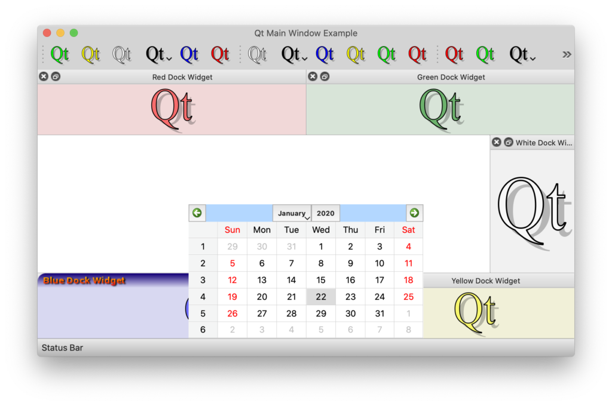

# Anchor Layout for Widgets

I really enjoy using QML. It allows developers to create incredible user interfaces without sacrificing good software architecture. It’s just fantastic!

One of my favorite features of QML is Anchor Layouts. Before using QML, I was familiar with layouts like `QVBoxLayout`, `QHBoxLayout`, `QGridLayout`, and `QFormLayout`. These tools helped arrange and resize widget content in specific ways. 

They worked well for me until I discovered Anchor Layouts in QML! 

Now, when I switch back to creating UIs with widgets, I really miss the flexibility of Anchor Layouts. I love being able to position one UI element relative to another—like placing one to the right, left, above, or below another element. I can also easily set one element to be as wide as another while positioning it on top. 

This straightforwardness isn't as easy to achieve with traditional widgets. So, I decided to create an `AnchorLayout` class for use with QtWidgets. 

## For the uninformed: what is an Anchor Layout?

Qt’s layout classes `QVBoxLayout`, `QHBoxLayout`, `QGridLayout`, and `QFormLayout` distributes space available in a container widget among its child widgets using some logic. 

Anchor Layouts on the other hand think of a container and its contents as a UI elements with each of them having invisible anchor lines as follows


We then setup UI elements such that one UI element’s anchor-line is “anchored” to another UI element’s anchor-line. Of-course, this works as long as the UI elements in question are either siblings OR share a container-contained relationship.

In addition to being able to “anchor” lines on each other, we can also establish a space between them, by specifying a margin. When we anchor one item on another, we can in addition to that also say that we need a margin. That way we can introduce space between UI elements.


For example: we could say, anchor the left-edge of blue UI element to the right-edge of a red UI element.


We can also say that we want the left edge of the blue UI element to be positioned to the right of the red UI element, with a 10-pixel gap between the two.


The way we think anchor-layouts is distinct from the way we think `QLayout`s. 

When we think “anchor-layouts” we think pretty much like how we would think when we arrange objects on our desk. Place one item to the right of the other, top of the other OR place this item to the extreme right of the table, that one to the extreme left and so on.

Anchor Layouts are more natural to think than traditional `QLayout`s. That is not to say that traditional layouts are bad. Having an option to mix-and-match and use both is better.

## Simple Example

Suppose I wanted to place a `QFrame` within a `QWidget` such that it would occupy the entire container, by leaving behind some margin.

```cpp
    int main(int argc, char **argv)
    { 
        QApplication a(argc, argv);
    
        QWidget container;
    
        QFrame *frame = new QFrame(&container); 
        frame->setFrameStyle(QFrame::Box);
    
        /************************************
        Trying to mimick...
        
        QWidget {
            id: container
            
            QFrame {
                anchors.fill: container
                anchors.margins: 50
            }
        }
        ************************************/
        
        AnchorLayout::get(frame)
                ->fill(AnchorLayout::get(&container))
                ->setMargins(50);
    
        container.resize(400, 400); container.show();
    
        return a.exec(); 
    }
```

When executed, we will get an output like this.


Surely this can be accomplished using a `QVBoxLayout` or `QHBoxLayout` as well. We are not competing with existing layouts. Only trying to bring the power of Anchor Layouts in QML to the QtWidgets world.

## Show the frame in the bottom right quadrant 

Suppose we wanted to show the frame in the bottom right quadrant of the container leaving a 20 pixel margin around, like this.


This is of course possible with `QGridLayout`, but somehow getting the placement right will be an issue. We will have to play around with `sizeHint()`, `sizePolicy()` of the frame effectively to achieve this result. You see, we want the frame to be in the bottom right quadrant, leaving a 20 pixel margin around even when the widget is resized.


With the `AnchorLayout` class, it is as simple as this. Notice how we borrow the anchor-lines concept from QML into this.

```cpp
    int main(int argc, char **argv)
    {
        QApplication a(argc, argv);
    
        QWidget container;
    
        QFrame *frame = new QFrame(&container);
        frame->setFrameStyle(QFrame::Box);
        
        /************************************
        Trying to mimick...
        
        QWidget {
            id: container
            
            QFrame {
                anchors.left: container.horizontalCenter
                anchors.leftMargin: 20
                
                anchors.top: container.verticalCenter
                anchors.topMargin: 20
                
                anchors.right: container.right
                anchors.rightMargin: 20
                
                anchors.bottom: container.bottom
                anchors.bottomMargin: 20
            }
        }
        ************************************/
    
        AnchorLayout *containerLayout = AnchorLayout::get(&container);
        AnchorLayout *frameLayout = AnchorLayout::get(frame);
    
        frameLayout->left()
                   ->anchorTo(containerLayout->horizontalCenter())
                   ->setMargin(20);
        frameLayout->top()
                   ->anchorTo(containerLayout->verticalCenter())
                   ->setMargin(20);
        frameLayout->right()
                   ->anchorTo(containerLayout->right())
                   ->setMargin(20);
        frameLayout->bottom()
                   ->anchorTo(containerLayout->bottom())
                   ->setMargin(20);
    
        container.resize(400, 400);
        container.show();
    
        return a.exec();
    }
```

Each `AnchorLayout` instance has `left()`, `right()`, `top()`, `bottom()`, `horizontalCenter()` and `verticalCenter()` `AnchorLine`s. These lines can be made to coincide with `AnchorLine`s of other layouts.

Placing widgets in a container is simply a matter of anchoring their anchor-lines of their anchor-layouts with each other. As the anchor lines move, they take the edges of the widgets they represent with them. This way the pull-and-push of anchor lines effectively places and resizes the widgets.

## Place two frames in the center, separated by a space 

Suppose wanted to place two frames next to each other, in the center of a container such that

- The width of each frame is 35% of the width of the container 
- The height of each frame is 50% of the height of the container 

Like this:


Once again, the idea is to ensure that width and height ratios vis-a-vis the container must remain
consistent when the container is resized.


Here is how we would use the `AnchorLayout` class to make this happen.

```cpp
    int main(int argc, char **argv)
    {
        QApplication a(argc, argv);
    
        QWidget container;
    
        QLabel *frame1 = new QLabel(&container);
        frame1->setFrameStyle(QFrame::Box);
        frame1->setText("One");
        frame1->setAlignment(Qt::AlignCenter);
    
        QLabel *frame2 = new QLabel(&container);
        frame2->setFrameStyle(QFrame::Box);
        frame2->setText("Two");
        frame2->setAlignment(Qt::AlignCenter);
    
        AnchorLayout *containerLayout = AnchorLayout::get(&container);
    
        AnchorLayout *frame1Layout = AnchorLayout::get(frame1);
        frame1Layout->left()
                    ->anchorTo(containerLayout->customLine(Qt::Vertical,0.15))
                    ->setMargin(-5);
        frame1Layout->right()
                    ->anchorTo(containerLayout->horizontalCenter())
                    ->setMargin(5);
        frame1Layout->top()
                    ->anchorTo(containerLayout->customLine(Qt::Horizontal,0.25));
        frame1Layout->bottom()
                    ->anchorTo(containerLayout->customLine(Qt::Horizontal,-0.25));
    
        AnchorLayout *frame2Layout = AnchorLayout::get(frame2);
        frame2Layout->right()
                    ->anchorTo(containerLayout->customLine(Qt::Vertical,-0.15))
                    ->setMargin(-5);
        frame2Layout->left()
                    ->anchorTo(containerLayout->horizontalCenter())
                    ->setMargin(5);
        frame2Layout->top()
                    ->anchorTo(containerLayout->customLine(Qt::Horizontal,0.25));
        frame2Layout->bottom()
                    ->anchorTo(containerLayout->customLine(Qt::Horizontal,-0.25));
    
        container.resize(600, 400);
        container.show();
    
        return a.exec();
    }
```

Notice the use of `customLine()` method. In addition to `left()`, `top()`, `right()`, `bottom()`, `horizontalCenter()` and `verticalCenter()` anchor lines, we can create custom anchor lines. Anchor Lines are either horizontal or vertical lines. They show up at a particular distance from the layout’s edge. For example

- A `Qt::HorizontalLine` at `0.25` distance is a horizontal line that is 25% of the width from the left of the layout. 
- A `Qt::HorizontalLine` at -0.25 distance is a horizontal line that is 25% of the width from the right of the layout 

Like all `AnchorLine`s, custom `AnchorLines` can be used to anchor another another anchor-line on it as long as the orientations match. Also note how we are able to easily introduce space in-between the frames using margins.

## We want one one of the frames to stick to the top, the other to the bottom. 

Suppose want to achieve this.


Notice that "one" and "two" are taller than before. They are actually 75% as tall as the container. While frame one is aligned to the top, frame two is aligned to the bottom. But note also the margin and spacing. The code for accomplishing this result is almost similar to what we have written before. I have highlighted the changes.

```cpp
    int main(int argc, char **argv)
    {
        QApplication a(argc, argv);
    
        QWidget container;
    
        QLabel *frame1 = new QLabel(&container);
        frame1->setFrameStyle(QFrame::Box);
        frame1->setText("One");
        frame1->setAlignment(Qt::AlignCenter);
    
        QLabel *frame2 = new QLabel(&container);
        frame2->setFrameStyle(QFrame::Box);
        frame2->setText("Two");
        frame2->setAlignment(Qt::AlignCenter);
    
        AnchorLayout *containerLayout = AnchorLayout::get(&container);
    
        AnchorLayout *frame1Layout = AnchorLayout::get(frame1);
        frame1Layout->left()
                ->anchorTo(containerLayout->customLine(Qt::Vertical, 0.15))
                ->setMargin(-5);
        frame1Layout->right()
                ->anchorTo(containerLayout->horizontalCenter())
                ->setMargin(5);
        frame1Layout->top()->anchorTo(containerLayout->top())->setMargin(10);
        frame1Layout->bottom()
                ->anchorTo(containerLayout->customLine(Qt::Horizontal, -0.25))
                ->setMargin(-10);
    
        AnchorLayout *frame2Layout = AnchorLayout::get(frame2);
        frame2Layout->right()
                ->anchorTo(containerLayout->customLine(Qt::Vertical, -0.15))
                ->setMargin(-5);
        frame2Layout->left()
                ->anchorTo(containerLayout->horizontalCenter())
                ->setMargin(5);
        frame2Layout->top()
                ->anchorTo(containerLayout->customLine(Qt::Horizontal, 0.25))
                ->setMargin(-10);
        frame2Layout->bottom()->anchorTo(containerLayout->bottom())->setMargin(10);
    
        container.resize(600, 400);
        container.show();
    
        return a.exec();
    }
```

Accomplishing something like this with traditional layouts, though possible, would be quite tricky. You have to play around with stretch factors, alignments, size hints and policies. Anchor Layout just makes all this very straight forward.

## Typical Application UI 

A typical application UI consists of a central document area, surrounded by other widgets.


Although a `QMainWindow` does indeed provide us with this construct, lets look at how we can construct
such a layout by ourselves using AnchorsLayout.

Firstly, let us spell out the ratio, proportions and fixed sizes of each area

- The menu-bar area is always along the top, occupying the full width of the window. It has a fixed height of 30 pixels. 
- The status-bar-area is always along the bottom, occupying the full width of the window. It also has a fixed height of 30 pixels. 
- The tool-box and config-box areas are to the left and right; occupying roughly 20% of the window width. 
- The remaining space is occupied by the document-area. 

```cpp
    int main(int argc, char **argv)
    {
        QApplication a(argc, argv);
    
        auto createFrame = [](const QString &text, QWidget *parent) {
            QLabel *label = new QLabel(parent);
            label->setFrameStyle(QFrame::Box);
            label->setText(text);
            label->setAlignment(Qt::AlignCenter);
            return label;
        };
    
        QWidget container;
        QWidget *documentArea = createFrame("document-area", &container);
        QWidget *menuBarArea = createFrame("menu-bar-area", &container);
        QWidget *toolBoxArea = createFrame("tool-box-area", &container);
        QWidget *configBoxArea = createFrame("config-box-area", &container);
        QWidget *statusBarArea = createFrame("status-bar-area", &container);
    
        AnchorLayout *containerLayout = AnchorLayout::get(&container);
    
        AnchorLayout *menuBarLayout = AnchorLayout::get(menuBarArea);
        menuBarLayout->left()
                    ->anchorTo(containerLayout->left());
        menuBarLayout->right()
                    ->anchorTo(containerLayout->right());
        menuBarLayout->top()
                    ->anchorTo(containerLayout->top());
        menuBarArea->setFixedHeight(30);
    
        AnchorLayout *statusBarLayout = AnchorLayout::get(statusBarArea);
        statusBarLayout->left()
                    ->anchorTo(containerLayout->left());
        statusBarLayout->right()
                    ->anchorTo(containerLayout->right());
        statusBarLayout->bottom()
                    ->anchorTo(containerLayout->bottom());
        statusBarArea->setFixedHeight(30);
    
        AnchorLayout *configBoxLayout = AnchorLayout::get(configBoxArea);
        configBoxLayout->right()
                    ->anchorTo(containerLayout->right());
        configBoxLayout->top()
                    ->anchorTo(menuBarLayout->bottom())
                    ->setMargin(2);
        configBoxLayout->bottom()
                    ->anchorTo(statusBarLayout->top())
                    ->setMargin(2);
        configBoxLayout->left()
                    ->anchorTo(containerLayout->customLine(Qt::Vertical,-0.2));
    
        AnchorLayout *toolBoxLayout = AnchorLayout::get(toolBoxArea);
        toolBoxLayout->left()
                    ->anchorTo(containerLayout->left());
        toolBoxLayout->top()
                    ->anchorTo(menuBarLayout->bottom())
                    ->setMargin(2);
        toolBoxLayout->bottom()
                    ->anchorTo(statusBarLayout->top())
                    ->setMargin(2);
        toolBoxLayout->right()
                    ->anchorTo(containerLayout->customLine(Qt::Vertical,0.2));
    
        AnchorLayout *documentAreaLayout = AnchorLayout::get(documentArea);
        documentAreaLayout->left()
                    ->anchorTo(toolBoxLayout->right())
                    ->setMargin(2);
        documentAreaLayout->top()
                    ->anchorTo(toolBoxLayout->top());
        documentAreaLayout->right()
                    ->anchorTo(configBoxLayout->left())
                    ->setMargin(2);
        documentAreaLayout->bottom()
                    ->anchorTo(configBoxLayout->bottom());
    
        container.resize(600, 400);
        container.show();
    
        return a.exec();
    }
```

Notice how we are able to easily place areas relative to each other. Notice also how we are able to use `setFixedHeight()` to specify some hardcoded sizes. Once we have sorted out the placement of areas, we can now go ahead and place widgets within them using traditional QLayouts or using AnchorLayouts. 

## AnchorLayout does not inherit QLayout 

The `AnchorLayout` class does not inherit `QLayout`. It makes use of event-filters to look up resize events and recalculates placement of anchor-lines. Each anchor-line then cascades its placement to other anchor-lines connected to it. Recursively the entire widget UI is placed and sized. This also means that we can use an `AnchorLayout` on top of existing layouts. This is especially useful when you want to stack a widget on top of another widget, which may already have a layout, but still want to have control over its placement.

### Example: Let’s take Qt’s QMainWindow sample application.


Now, lets say we want to hover a calendar widget on top of the main-window such that it comes exactly above the status-bar area, but horizontally centered. Like this:



Existing main-window layouts do not provide us any facility to accommodate temporary widgets like this. But with `AnchorLayout`, we can do something like this

```cpp
    MainWindow::MainWindow(const CustomSizeHintMap &customSizeHints,
                           QWidget *parent, Qt::WindowFlags flags)
        : QMainWindow(parent, flags)
    {
        // ......
    
        AnchorLayout *mainWindowLayout = AnchorLayout::get(this);
        AnchorLayout *statusBarLayout = AnchorLayout::get(this->statusBar());
    
        QCalendarWidget *calendarWidget = new QCalendarWidget(this);
        calendarWidget->setGridVisible(true);
    
        AnchorLayout *calendarLayout = AnchorLayout::get(calendarWidget);
    
        calendarLayout->bottom()
                ->anchorTo(statusBarLayout->top())
                ->setMargin(1);
        calendarLayout->horizontalCenter()
                ->anchorTo(mainWindowLayout->horizontalCenter());
        calendarWidget->setFixedSize(350, 200);
    }
```

What if we wanted for the calendar widget to slightly overlap the status bar area, such that the bottom edge of the calendar goes all the way to 50% of the status-bar height?


We just need to make a really small code change.

```cpp
    calendarLayout->bottom()
            ->anchorTo(statusBarLayout->verticalCenter()); 
```

In this example, we are showing a calendar widget. But in a real world application, it is perfectly possible that whenever we select a file to open, we want to show a temporary widget near the status bar like this which shows load-progress. We want for this temporary widget to be visible within the boundary of the main-window; but placed appropriately.

Surely there are plenty of real-world use cases for using an Anchor Layout in Widgets UI. If you want to take the Anchor Layout for a spin, please pull a copy of the sample code from here and try it out!
